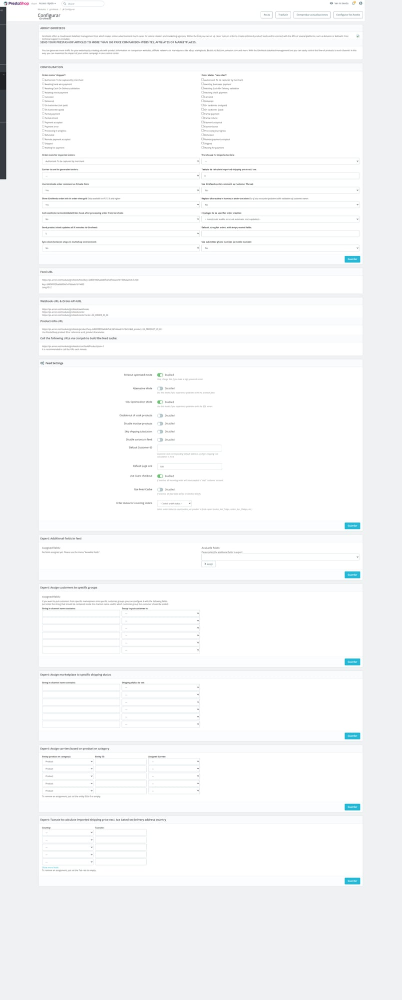
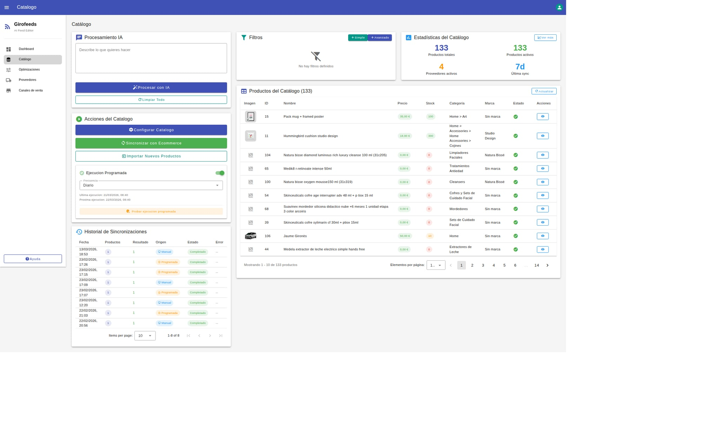
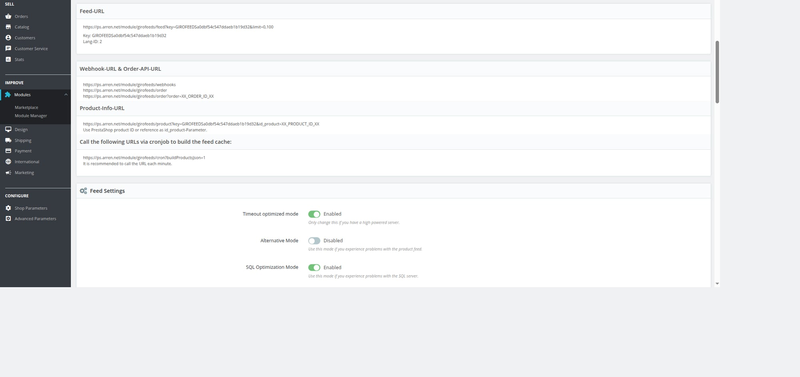

## Girofeeds Integration Flow (PrestaShop ↔ Girofeeds)

### 1) Module configuration in PrestaShop

### 2) Product synchronization from Girofeeds

### 3) API Key and endpoint setup
In the PrestaShop module config, copy the API key and endpoint URLs (Feed-URL, Webhook-URL & Order-API-URL, Product-Info-URL) and use them in Girofeeds provider setup.

### 4) Update product data in Girofeeds and sync back to PrestaShop
- Edit title, description, images in Girofeeds
- Run **Sincronizar con Ecommerce**
- Validate updated data in PrestaShop product edit page
