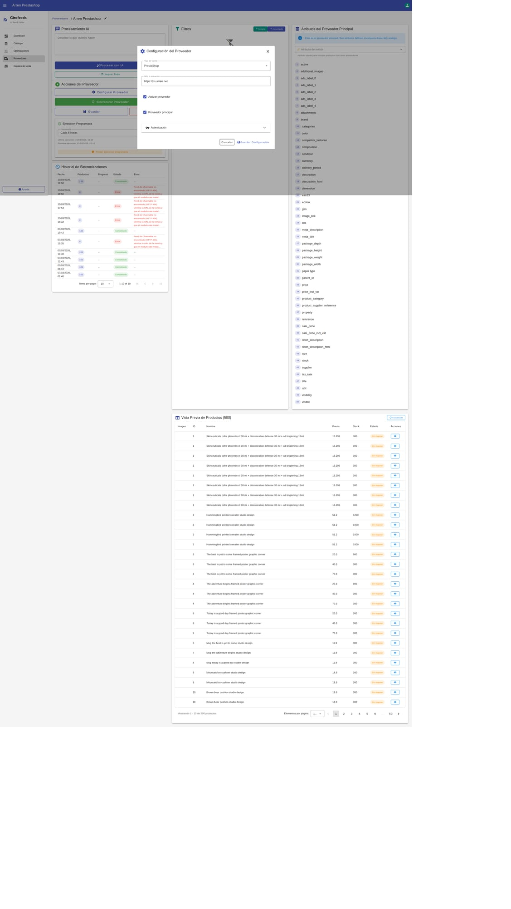
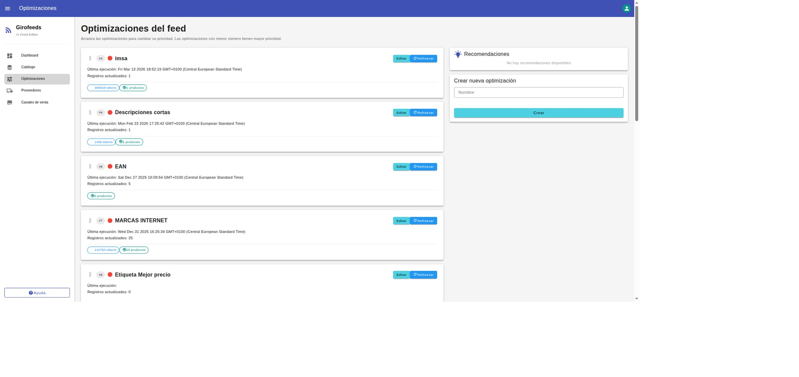
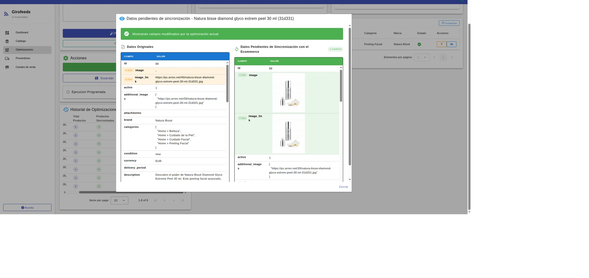
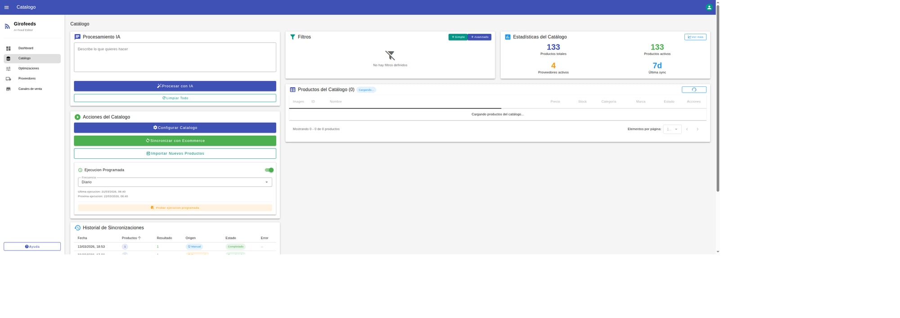

# Girofeeds PrestaShop Addon | AI Catalog Optimization for eCommerce

The **Girofeeds PrestaShop Addon** connects your PrestaShop store with Girofeeds, an AI-powered catalog optimization platform designed to improve product data, marketing performance and ecommerce visibility across multiple sales channels.

Girofeeds is not just a feed manager. It is an intelligent catalog improvement tool that helps ecommerce teams, agencies and online stores optimize product titles, descriptions, images, attributes and marketing-ready content using AI.

Visit Girofeeds:  
https://girofeeds.com/

## What is Girofeeds?

Girofeeds is an AI catalog optimization platform for ecommerce. It helps online stores improve the quality of their product catalog, fix data issues, enrich product content and prepare optimized product information for channels such as:

- Google Shopping
- Google Merchant Center
- Meta Ads
- Marketplaces
- Price comparison engines
- SEO
- Ecommerce CMS platforms such as PrestaShop, Magento, WooCommerce and Shopify

With Girofeeds, product catalog management becomes faster, smarter and easier to scale.

## Why use Girofeeds with PrestaShop?

Product catalogs are one of the most important assets of an ecommerce business. Poor product titles, incomplete descriptions, low-quality images or missing attributes can reduce visibility, affect advertising performance and create problems in product feeds.

The Girofeeds PrestaShop Addon allows you to connect your store with Girofeeds and manage catalog improvements from a centralized AI-powered platform.

With this integration, you can:

- Import product data from PrestaShop into Girofeeds.
- Analyze and improve product information with AI.
- Optimize titles, descriptions, images and attributes.
- Improve product content for SEO and marketing campaigns.
- Prepare better product data for Google Shopping and Merchant Center.
- Review before/after changes before applying optimizations.
- Synchronize improved product data back to PrestaShop.

## Key benefits

### AI-powered catalog improvement

Girofeeds helps you transform raw product data into optimized ecommerce content. The platform can assist with product titles, descriptions, attributes, images and marketing-oriented product information.

### Better product visibility

Optimized product data can help improve visibility in search engines, shopping campaigns, marketplaces and comparison platforms.

### Marketing-ready product content

Girofeeds helps ecommerce teams create product information that is better prepared for paid campaigns, organic search and multi-channel selling.

### Bidirectional ecommerce synchronization

The PrestaShop addon allows data to flow between PrestaShop and Girofeeds, so product improvements can be sent back to the ecommerce CMS after review.

### Designed for agencies and ecommerce teams

Girofeeds is especially useful for marketing agencies, SEM specialists, ecommerce managers and online stores that need to manage medium or large product catalogs efficiently.

## Main features of the Girofeeds PrestaShop Addon

- Connect PrestaShop with Girofeeds using API keys and endpoints.
- Synchronize product catalog data from PrestaShop.
- Manage product optimizations inside Girofeeds.
- Improve titles, descriptions, images and product attributes.
- Preview catalog changes before applying them.
- Send optimized product data back to PrestaShop.
- Support workflows for SEO, Google Shopping, Merchant Center and ecommerce marketing.
- Reduce manual catalog work through AI-assisted optimization.

## Girofeeds Integration Flow: PrestaShop ↔ Girofeeds

### 1) Module configuration in PrestaShop

Install and configure the Girofeeds addon in your PrestaShop back office.

### 2) API Key and endpoint setup

In the PrestaShop module configuration, copy the API key and endpoint URLs:

- Feed URL
- Webhook URL
- Order API URL
- Product Info URL

Then configure these values in your Girofeeds account.

### 3) Product synchronization from Girofeeds

Run the synchronization process from the Girofeeds catalog to send updated product data to PrestaShop.

### 4) Product edition and AI optimizations in Girofeeds

Open an optimization in Girofeeds and edit product fields such as:

- Product title
- Product description
- Product images
- SEO fields
- Product attributes
- Marketing content
- Feed attributes

You can review the before and after values in the optimization preview before applying changes.

### 5) Sync optimized catalog data back to PrestaShop

From the **Catalog** section in Girofeeds, click **Sync with Ecommerce** to send the optimized product data back to your PrestaShop store.

### 6) Validation in PrestaShop

Open the product edit page in PrestaShop and verify that the updated fields have been correctly applied.

You can validate changes such as:

- Optimized product titles
- Improved descriptions
- Updated product images
- SEO content
- Marketing-ready product information
- Feed-ready product data

## Who is Girofeeds for?

Girofeeds is designed for:

- PrestaShop store owners
- Ecommerce managers
- Digital marketing agencies
- Google Shopping specialists
- SEO consultants
- SEM managers
- Catalog managers
- Marketplace teams
- Online retailers with medium or large product catalogs

If you manage hundreds or thousands of products, Girofeeds helps you improve catalog quality, reduce repetitive manual work and prepare your ecommerce data for better marketing performance.

## Improve your PrestaShop catalog with AI

A strong ecommerce catalog is not only a technical feed. It is the foundation of your SEO, Google Shopping campaigns, marketplace visibility and product marketing strategy.

Girofeeds helps you improve your catalog with AI, optimize product information and synchronize the improved data back to your ecommerce platform.

Start improving your PrestaShop catalog today:

https://girofeeds.com/
